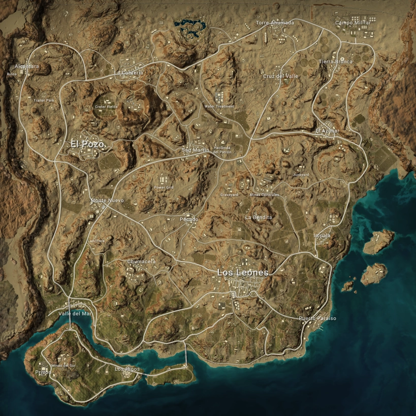
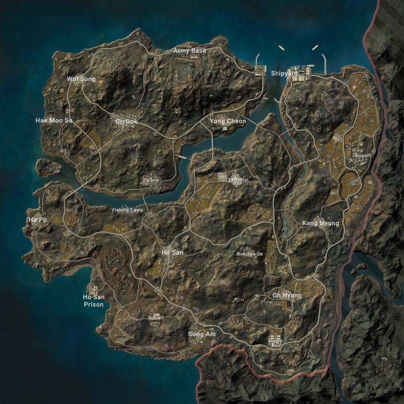
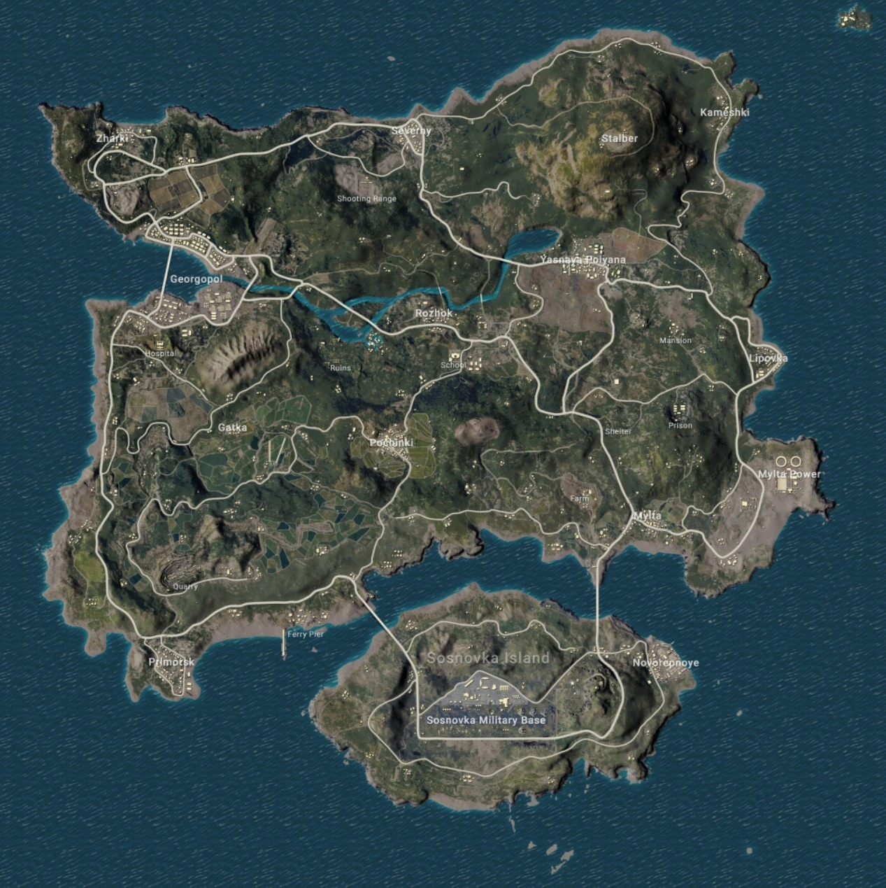
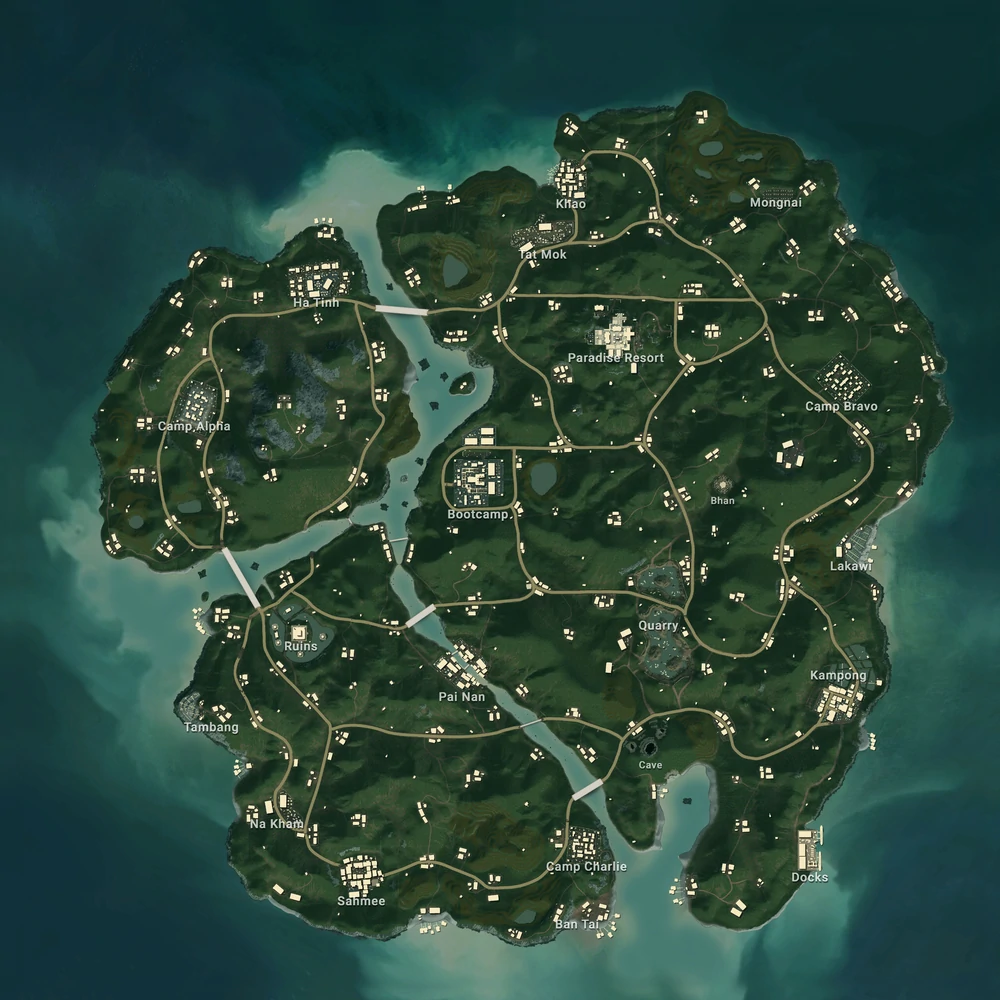
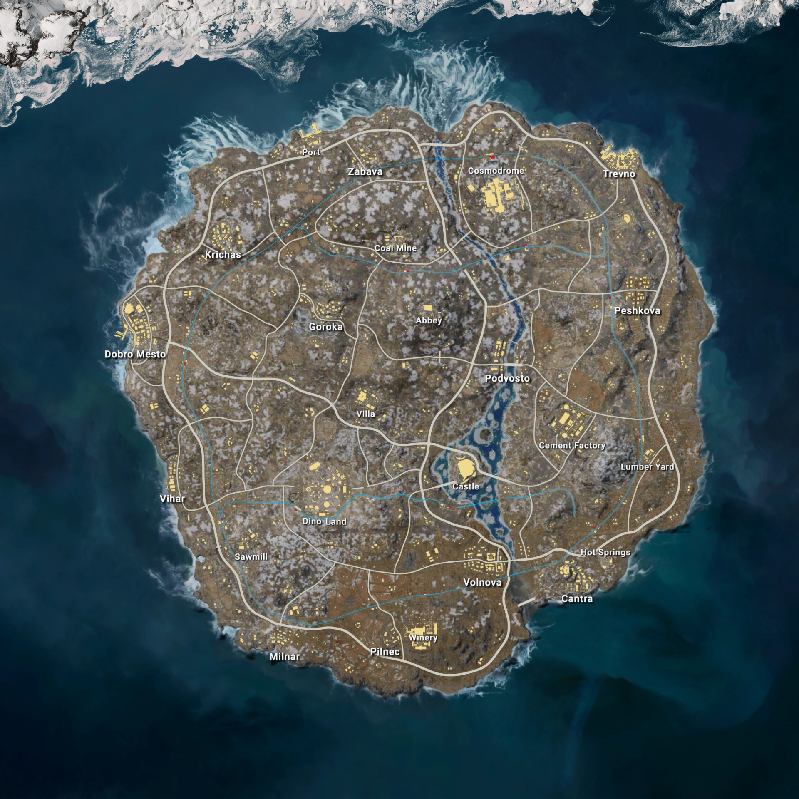
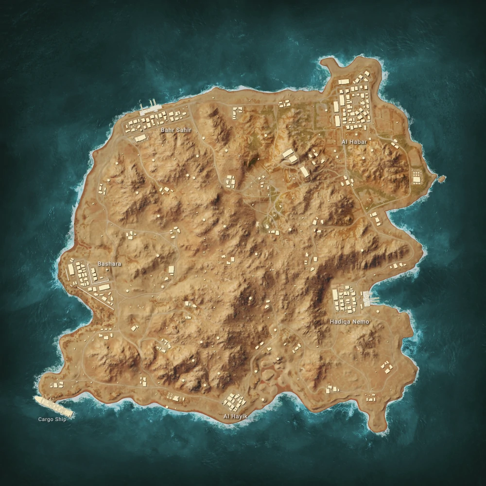
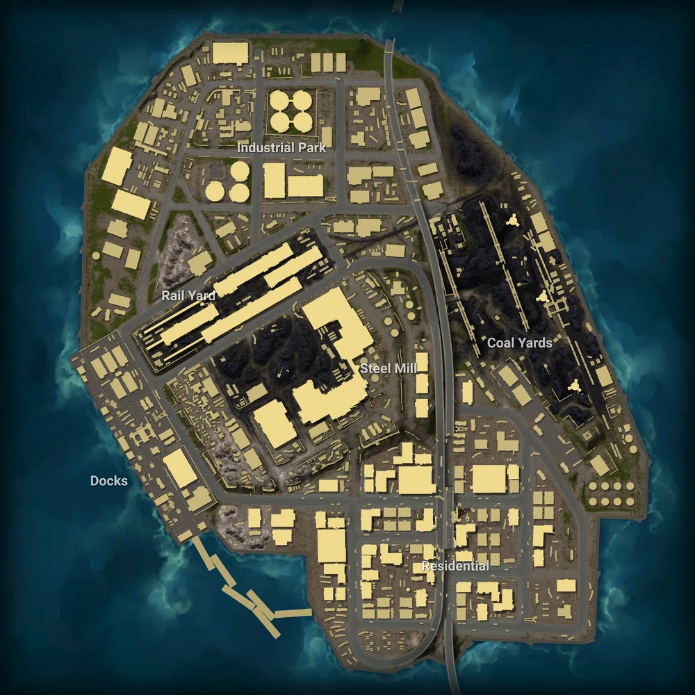
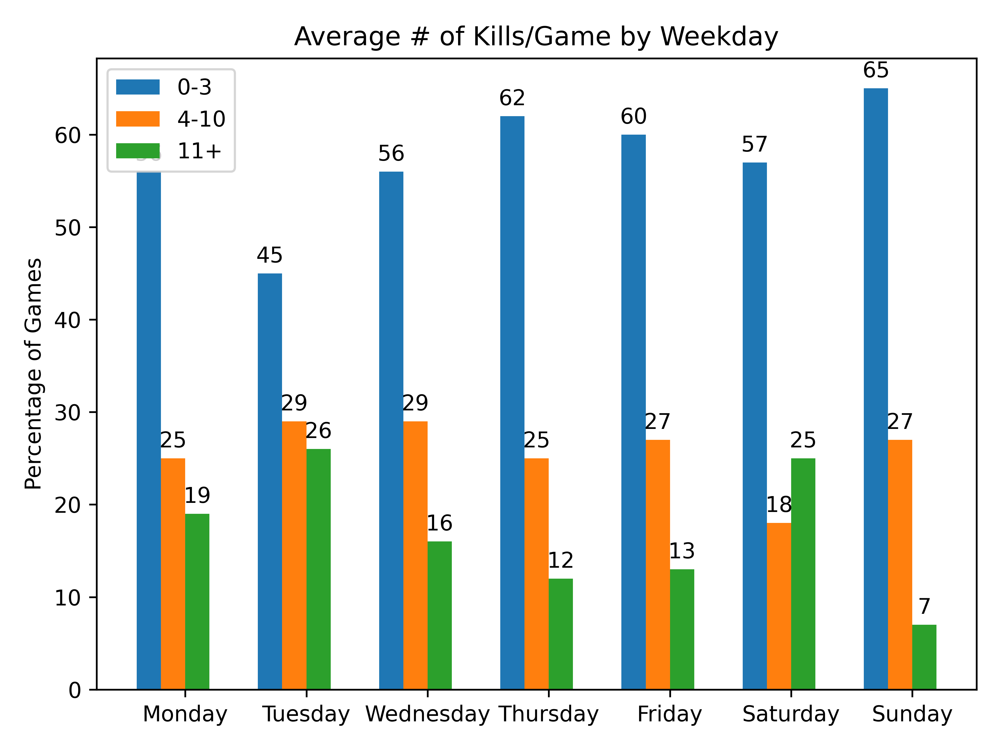
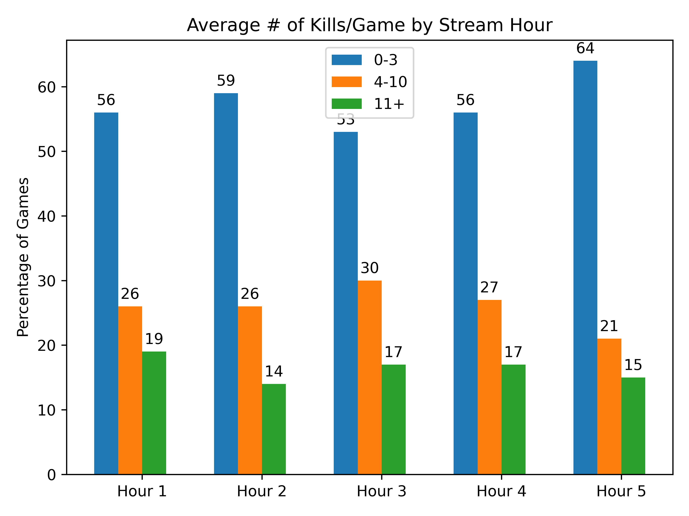

# Forsen BabaG Stats
##### 862 Games (Mar 27 2022 - May 28 2022)
|Map|Image| 0-3 | 4-10 | 11+ |
| :-: | :-: | :-: | :--: | :-: |
| **Miramar (230 games)** 100 Players|  | 55.65% | 32.61% | 11.74% |
| **Taego (215 games)** 100 Players|  | 57.21% | 27.44% | 15.35% |
| **Erangel (Remastered) (201 games)** 100 Players|  | 52.24% | 26.87% | 20.9% |
| **Sanhok (76 games)** 100 Players|  | 64.47% | 31.58% | 3.95% |
| **Vikendi (57 games)** 100 Players|  | 54.39% | 24.56% | 21.05% |
| **Karakin (48 games)** 64 Players|  | 77.08% | 20.83% | 2.08% |
| **Haven (35 games)** 32 Players|  | 57.14% | 37.14% | 5.71% |

|Kills By Weekday|Kills By Hour|
| :-: | :-: |
|  |  |
