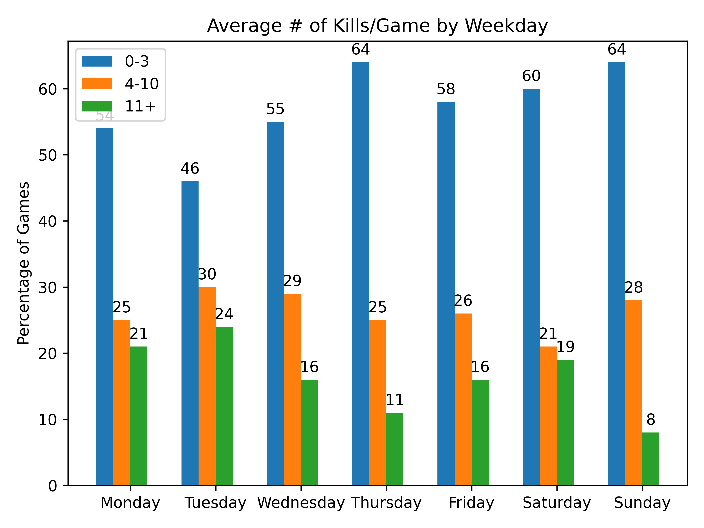

# Forsen BabaG Stats
##### 649 Games (Mar 27 2022 - May 16 2022)
|Map|Image| 0-5 | 6-10 | 11+ |
| :-: | :-: | :-: | :--: | :-: |
| **Miramar (192 games)** |  | 66.15% | 22.4% | 11.46% |
| **Erangel (Remastered) (162 games)** |  | 61.73% | 17.28% | 20.99% |
| **Taego (155 games)** |  | 67.74% | 17.42% | 14.84% |
| **Karakin (48 games)** |  | 87.5% | 10.42% | 2.08% |
| **Sanhok (45 games)** |  | 80.0% | 15.56% | 4.44% |
| **Haven (35 games)** |  | 71.43% | 22.86% | 5.71% |
| **Vikendi (12 games)** |  | 83.33% | 0.0% | 16.67% |
 
