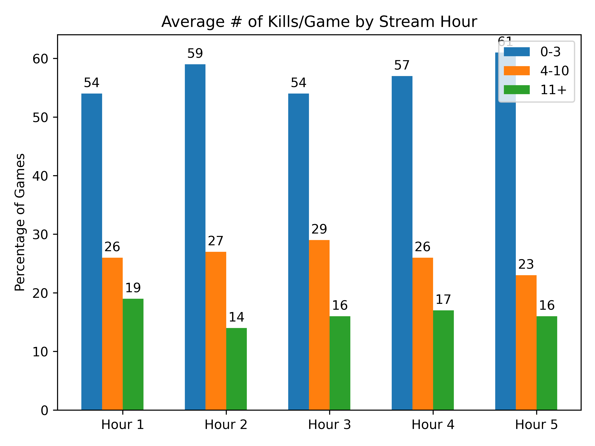

# Forsen BabaG Stats
##### 965 Games (Mar 27 2022 - Jun 06 2022)
|Map|Image| 0-3 | 4-10 | 11+ |
| :-: | :-: | :-: | :--: | :-: |
| **Miramar (252 games)** 100 Players|  | 54.76% | 33.33% | 11.9% |
| **Taego (232 games)** 100 Players|  | 56.9% | 28.02% | 15.09% |
| **Erangel (Remastered) (225 games)** 100 Players|  | 52.89% | 27.11% | 20.0% |
| **Sanhok (97 games)** 100 Players|  | 64.95% | 29.9% | 5.15% |
| **Vikendi (76 games)** 100 Players|  | 57.89% | 23.68% | 18.42% |
| **Karakin (48 games)** 64 Players|  | 77.08% | 20.83% | 2.08% |
| **Haven (35 games)** 32 Players|  | 57.14% | 37.14% | 5.71% |

|Kills By Weekday|Kills By Hour|
| :-: | :-: |
|  |  |
